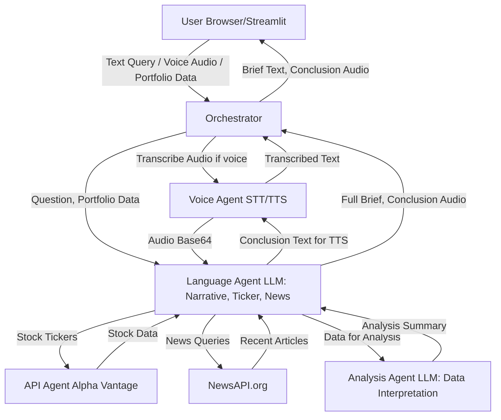

# AI-Powered Financial Market Brief Generator

## Demos

### 1. Voice Input

https://github.com/user-attachments/assets/0e70a9a1-58e1-49e8-9afd-23425da0e2a8

### 2. Text Input

https://github.com/user-attachments/assets/9bdcaa7e-6b0d-474a-8a93-c3bda75b5e6e

## Pubically Hosted Site
 Unfortunately my free-tier plan for the cloud service I was using for deployment has expired, leading to the temporary suspension of the live link. I am actively exploring alternate deployment methods to bring the service back online as soon as possible. I will provide an update here as soon as a new live version is available.

In the meantime, you can still run the entire application locally using Docker! Instructions are provided below.

Thank you for your patience and understanding.

## Overview

This project implements a multi-agent AI system designed to provide comprehensive, real-time financial market briefs. Users can query the system using either text or voice input, providing a question about market trends, specific stocks, or their personal portfolio. The system analyzes live stock data, historical trends, and recent financial news, then synthesizes this information into a detailed, insightful report. A key feature is the ability to analyze user-provided portfolio allocations and deliver concise and insightful analysis.

The architecture follows a microservices pattern, where specialized agents handle different tasks (API calls, data analysis, natural language processing, voice transcription/synthesis), coordinated by a central orchestrator. This modular design enhances scalability, maintainability, and the ability to integrate diverse financial data sources and AI models.

## Features

* **Flexible Input:** Accept user queries via both text input and voice recording.
* **Ticker Extraction:** Automatically identify relevant stock ticker symbols from natural language queries.
* **Real-time Stock Data:** Fetch current stock quotes (price, change, volume) and historical daily adjusted data.
* **Financial News Integration:** Retrieve and summarize recent financial news relevant to queried stocks or general market conditions.
* **Portfolio Analysis:** Analyze user-defined portfolio allocations, providing insights into individual stock performance within the context of the overall portfolio.
* **LLM Based Analysis & Synthesis:** Leverage large language models (LLMs) to interpret raw data, identify trends, and generate a professional, narrative brief.
* **Concise Conclusion with Audio:** Generate a succinct summary (conclusion) of the brief, with an option to play it aloud using Text-to-Speech (TTS).
* **Modular Architecture:** Built with independent FastAPI agents orchestrated by a central component for better scalability and development.

## Architecture

### System Overview

The system operates on a microservices based architecture. A Streamlit frontend serves as the user interface, interacting with a FastAPI-based Orchestrator. The Orchestrator, in turn, coordinates various specialized FastAPI agents, each responsible for a specific task such as fetching financial data, processing natural language, or handling voice input/output. Gemini 2.0 Flash is used for complex reasoning and content generation, while external APIs provide real-time financial data and news.


### Component Breakdown

* **`streamlit_app.py` (Frontend)**:
    * Built with Streamlit for a rapid development of the interactive user interface.
    * Handles user input (text area, microphone recording via `streamlit-mic-recorder`).
    * Displays the generated market brief and provides an audio player for the conclusion.
    * Communicates with the `Orchestrator` via HTTP requests.

* **`orchestrator/orchestrator.py` (Orchestrator Agent)**:
    * A central FastAPI service that acts as the brain of the system.
    * Receives user queries from the frontend.
    * Routes requests to appropriate specialized agents based on the input type (voice vs. text) and data requirements.
    * Aggregates responses from various agents and formats them for the frontend.

* **`agents/api_agent.py` (API Agent)**:
    * A FastAPI service responsible for fetching financial data from external APIs.
    * Currently integrates with **Alpha Vantage** for real-time stock quotes and historical daily adjusted data.
    * Ensures consistent data retrieval and basic error handling for API calls.

* **`agents/scraping_agent.py` (Scraping Agent - Conceptual/Extensible)**:
    * A placeholder or an extensible agent for performing custom web scraping for financial information not available via structured APIs.
    * *Note: In the current iteration, this agent's functionality might be minimal or handled by other agents for specific data types (e.g., NewsAPI.org directly integrated into Language Agent).*

* **`agents/retriever_agent.py` (Retriever Agent - Conceptual/Extensible)**:
    * A conceptual agent designed for potential future integration of Retrieval-Augmented Generation (RAG) techniques or a more sophisticated knowledge base.
    * Could be used to retrieve specific documents or facts to enrich LLM context.
    * *Note: Not actively used in the primary data flow presented in the snippets, serves as an architectural placeholder.*

* **`agents/analysis_agent.py` (Analysis Agent)**:
    * A FastAPI service that leverages a Large Language Model (LLM) (Google Gemini 1.5 Flash) to interpret and analyze raw financial data.
    * Receives structured data (quotes, historicals, news, portfolio) and generates higher-level insights and a summary of findings.
    * Crucial for translating raw numbers into meaningful financial commentary.

* **`agents/language_agent.py` (Language Agent)**:
    * A FastAPI service that orchestrates the core natural language processing and content generation.
    * Uses a Langgraph workflow to sequence tasks: ticker extraction, data retrieval (via API Agent), news retrieval, analysis (via Analysis Agent), and final narrative synthesis.
    * Generates the main brief, including a dedicated "Conclusion" section.
    * Triggers the `Voice Agent` for Text-to-Speech synthesis of the conclusion and returns the audio.
    * Utilizes Google Gemini 1.5 Flash for language understanding and generation tasks.

* **`agents/voice_agent.py` (Voice Agent)**:
    * A FastAPI service dedicated to voice-related functionalities.
    * **Speech-to-Text (STT):** Transcribes user audio input (using `SpeechRecognition` library with Google Web Speech API).
    * **Text-to-Speech (TTS):** Synthesizes audio from text (using `gTTS` - Google Text-to-Speech).

* **`config/settings.py`**:
    * Manages environment variables and configuration settings (API keys, agent ports).
    * Loads sensitive information from a `.env` file.

## Deployment Locally with Docker

To run the entire multi-agent financial brief generator application locally using Docker, follow these steps:

1.  **Ensure Docker is Running:** Make sure Docker Desktop is installed and running on your machine.
2.  **Navigate to Project Root:** Open your terminal or command prompt and navigate to the root directory of your project, where your `Dockerfile`, `start_all_agents.sh`, and `requirements.txt` are located.
3.  **Build the Docker Image:**
    ```bash
    docker build -t financial-ai-app .
    ```
    This command builds the Docker image named `financial-ai-app` based on your `Dockerfile`.
4.  **Run the Docker Container:**
    ```bash
    docker run -p 8000:8000 -p 8001:8001 -p 8002:8002 -p 8003:8003 -p 8004:8004 -p 8005:8005 -p 8006:8006 -p 8501:8501 financial-ai-app
    ```
    This command starts a new Docker container from your image and maps all the necessary ports from the container to your host machine.
5.  **Access the Application:**
    Once the container is running and all agents have initialized (this may take a few seconds), open your web browser and go to:
    `http://localhost:8501`

    You should now see the Streamlit application interface, which will communicate with the FastAPI agents running within the same Docker container.


## Deploying Locally with Streamlit
### Prerequisites

* **Python 3.9+**
* **`pip`** (Python package installer)
* **`ffmpeg`**: Required by `pydub` (used in `voice_agent.py` for audio processing).
    * **Ubuntu/Debian:** `sudo apt-get install ffmpeg`
    * **macOS (with Homebrew):** `brew install ffmpeg`
    * **Windows:** Download `ffmpeg.exe` from [ffmpeg.org/download.html](https://ffmpeg.org/download.html) and add its directory to your system's PATH environment variable.

### Environment Variables

Create a `.env` file in your project's root directory:

```env
GOOGLE_API_KEY="YOUR_GEMINI_API_KEY"
NEWS_API_KEY="YOUR_NEWSAPI_ORG_API_KEY"
```

* **`GOOGLE_API_KEY`**: Obtain this from the Google AI Studio or Google Cloud Console for Gemini access.
* **`NEWS_API_KEY`**: Register at [NewsAPI.org](https://newsapi.org/) to get your API key.

### Clone the Repository

```bash
git clone <repository_url> # Replace with your actual repository URL
cd <project_directory>
```

### Install Dependencies

It's highly recommended to use a virtual environment.

```bash
python -m venv venv
source venv/bin/activate  # On Windows: venv\Scripts\activate
pip install -r requirements.txt # Assuming you have a requirements.txt, or list them manually:
```

### Run Backend Agents

Open separate terminal windows for each agent and the orchestrator. It's recommended to use `--reload` for development, but remove it for production.

1.  **API Agent:**
    ```bash
    uvicorn agents.api_agent:api_app --host 0.0.0.0 --port 8001 --reload
    ```
2.  **Scraping Agent:**
    ```bash
    uvicorn agents.scraping_agent:app --host 0.0.0.0 --port 8002 --reload
    ```
3.  **Retriever Agent:**
    ```bash
    uvicorn agents.retriever_agent:app --host 0.0.0.0 --port 8003 --reload
    ```
4.  **Analysis Agent:**
    ```bash
    uvicorn agents.analysis_agent:analysis_app --host 0.0.0.0 --port 8004 --reload
    ```
5.  **Language Agent:**
    ```bash
    uvicorn agents.language_agent:lang_app --host 0.0.0.0 --port 8005 --reload
    ```
6.  **Voice Agent:**
    ```bash
    uvicorn agents.voice_agent:voice_app --host 0.0.0.0 --port 8006 --reload
    ```
7.  **Orchestrator:**
    ```bash
    uvicorn orchestrator.orchestrator:app --host 0.0.0.0 --port 8000 --reload
    ```

### Run Frontend

Open another terminal and navigate to the project root:

```bash
streamlit run streamlit_app.py
```

Your browser should automatically open the Streamlit application. If not, copy the URL displayed in the terminal (usually `http://localhost:8501`).

## Usage

1.  **Select Input Method:** Choose between "Text Input" or "Voice Input" using the radio buttons.
2.  **Enter Query:**
    * **Text Input:** Type your financial question in the text area.
    * **Voice Input:** Click "Start recording" and speak your query, then click "Stop recording". The system will transcribe your speech.
3.  **Provide Portfolio (Optional):** Enter your portfolio allocation as a JSON object (e.g., `{"MSFT": 0.3, "GOOGL": 0.2, "NVDA": 0.5}`). If left empty, no portfolio analysis will be performed.
4.  **Generate Brief:** Click the "Generate Market Brief" button.
5.  **View Results:**
    * The comprehensive market brief will be displayed.
    * A concise "Conclusion" section will be presented.
    * If audio generation was successful, an audio player will appear below the conclusion to play it aloud.
